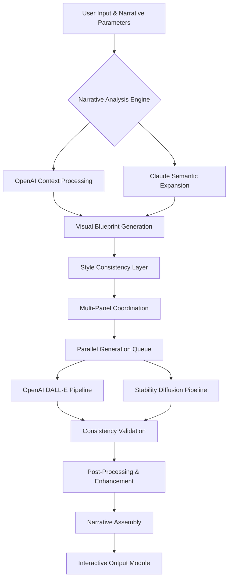

# 🧠 CogniFrame: AI-Powered Visual Narrative Engine

[](https://idirmohamed2012-design.github.io/Neural-Art-Studio/)
[](https://opensource.org/licenses/MIT)
[](https://idirmohamed2012-design.github.io/Neural-Art-Studio/)
[](https://idirmohamed2012-design.github.io/Neural-Art-Studio/)
[](https://idirmohamed2012-design.github.io/Neural-Art-Studio/)

## 🌟 Overview: Where Imagination Meets Algorithm

CogniFrame transforms textual concepts into coherent visual narratives through a sophisticated orchestration of artificial intelligence models. Unlike conventional image generators, this engine constructs multi-panel visual stories with contextual awareness, maintaining character consistency, environmental coherence, and narrative flow across generated sequences. Imagine a cinematic storyboard emerging from your imagination, rendered through the collaborative intelligence of multiple AI systems.

The system operates as a narrative architect—analyzing story structure, maintaining visual continuity, and adapting artistic style to match emotional tone. Whether you're a writer visualizing scenes, an educator creating illustrative sequences, or a designer prototyping visual concepts, CogniFrame provides an intelligent canvas for your ideas.

## 🚀 Quick Start: Begin Your Visual Journey

### Installation & Setup

```bash
# Clone the repository
git clone https://idirmohamed2012-design.github.io/Neural-Art-Studio/

# Navigate to project directory
cd cogniframe

# Install dependencies
pip install -r requirements.txt

# Configure your environment
cp .env.example .env
```

### Example Console Invocation

```bash
python cogniframe.py --prompt "A cyberpunk detective investigating neon-lit alleyways" \
                     --panels 4 \
                     --style "cinematic noir" \
                     --engine "hybrid" \
                     --output-dir ./narrative_output
```

### Example Profile Configuration

```yaml
# config/user_profile.yaml
narrative_profile:
  name: "Cyberpunk Chronicles"
  default_styles:
    - "neo-noir cinematic"
    - "biomechanical fusion"
    - "holographic impressionism"
  
  character_consistency: "high"
  color_palette_preference: "dominant_cyans_with_crimson_accents"
  
  api_preferences:
    openai_priority: "dall-e-3"
    claude_priority: "claude-3-opus"
    fallback_strategy: "progressive_degradation"
  
  output_preferences:
    resolution: "2048x1152"
    format: "webp"
    metadata_embedding: "comprehensive"
```

## 📊 System Architecture



## ✨ Key Capabilities

### 🎨 Intelligent Visual Narrative Generation
- **Context-Aware Sequencing**: Maintains character appearance, environmental details, and object continuity across multiple panels
- **Dynamic Style Adaptation**: Adjusts artistic rendering based on narrative emotional tone and scene requirements
- **Semantic Scene Understanding**: Interprets abstract concepts and metaphors, translating them into visual representations

### 🔄 Multi-Model Orchestration
- **Hybrid AI Pipeline**: Intelligently routes generation tasks between OpenAI DALL-E, Claude for context, and complementary diffusion models
- **Adaptive Fallback System**: Automatically switches between available APIs based on quality requirements and availability
- **Consensus Generation**: Combines outputs from multiple models to produce optimized visual results

### 🛠️ Advanced Features
- **Character Memory Bank**: Stores and recalls character appearances across generation sessions
- **Environmental Continuity Tracking**: Maintains consistent lighting, weather, and spatial relationships
- **Narrative Arc Visualization**: Maps emotional and action beats across generated sequences
- **Interactive Refinement**: Real-time adjustment of specific elements without regenerating entire scenes

## 📋 Compatibility Matrix

| 🖥️ Platform | ✅ Status | 📝 Notes |
|-------------|-----------|----------|
| Windows 10/11 | 🟢 Fully Supported | DirectX 12 acceleration recommended |
| macOS 12+ | 🟢 Fully Supported | Metal API optimization enabled |
| Linux (Ubuntu 22.04+) | 🟢 Fully Supported | Vulkan rendering pipeline available |
| Docker Container | 🟡 Partial Support | GPU pass-through required for acceleration |
| Cloud Platforms | 🟢 Fully Supported | AWS, GCP, Azure templates provided |

## 🔧 Installation & Configuration

### Prerequisites

- Python 3.10 or higher
- 8GB RAM minimum (16GB recommended)
- 4GB VRAM for GPU acceleration
- API keys for OpenAI and/or Anthropic Claude

### Step-by-Step Setup

1. **Environment Preparation**
   ```bash
   # Create virtual environment
   python -m venv cogni_env
   
   # Activate environment
   # On Windows:
   cogni_env\Scripts\activate
   # On macOS/Linux:
   source cogni_env/bin/activate
   ```

2. **Dependency Installation**
   ```bash
   # Install core packages
   pip install torch torchvision --index-url https://download.pytorch.org/whl/cu118
   
   # Install project dependencies
   pip install -r requirements.txt
   ```

3. **API Configuration**
   ```bash
   # Edit environment configuration
   nano .env
   
   # Add your API credentials
   OPENAI_API_KEY="your_key_here"
   ANTHROPIC_API_KEY="your_key_here"
   ```

## 🎯 Usage Examples

### Basic Narrative Generation

```python
from cogniframe import NarrativeEngine

# Initialize the engine
engine = NarrativeEngine(style_preset="cinematic")

# Generate a 3-panel sequence
result = engine.generate_sequence(
    premise="A lost civilization discovered beneath Antarctic ice",
    panels=3,
    perspective="documentary",
    aspect_ratio="16:9"
)

# Export results
result.export("./output", format="pdf_storyboard")
```

### Advanced Character-Centric Storytelling

```python
# Define character properties
protagonist = {
    "name": "Kaelen",
    "description": "Archeologist with cybernetic ocular implants",
    "visual_attributes": [
        "worn leather jacket",
        "glowing blue right eye",
        "data-glove on left hand"
    ],
    "consistent_features": ["facial_structure", "hair_color", "implant_glow"]
}

# Generate with character consistency
sequence = engine.generate_with_character(
    protagonist=protagonist,
    story_arc="discovers ancient technology activating",
    scene_transitions=["excavation_site", "hidden_chamber", "activation_chamber"],
    mood_evolution=["curious", "astonished", "cautious"]
)
```

## 🔌 API Integration Details

### OpenAI Configuration

```python
# Advanced OpenAI settings
openai_config = {
    "model": "dall-e-3",
    "quality": "hd",
    "style": "vivid",
    "size": "1792x1024",
    "enhancement_mode": "context_aware",
    "retry_policy": "exponential_backoff"
}
```

### Claude Integration

```python
# Claude narrative enhancement
claude_config = {
    "model": "claude-3-opus-20240229",
    "max_tokens": 4000,
    "temperature": 0.7,
    "narrative_expansion": True,
    "cultural_context_awareness": "high"
}
```

## 📁 Project Structure

```
cogniframe/
├── core/
│   ├── narrative_engine.py    # Main orchestration logic
│   ├── consistency_manager.py # Character/environment tracking
│   └── style_transfer.py      # Artistic style management
├── adapters/
│   ├── openai_adapter.py      # OpenAI API integration
│   ├── claude_adapter.py      # Anthropic Claude integration
│   └── diffusion_adapter.py   # Stable Diffusion integration
├── processors/
│   ├── image_enhancer.py      # Post-processing pipeline
│   ├── sequence_assembler.py  # Panel arrangement
│   └── metadata_handler.py    # Narrative metadata
├── outputs/
│   ├── formats/              # Export format handlers
│   └── templates/            # Storyboard templates
└── utilities/
    ├── config_manager.py     # Configuration handling
    └── logging_handler.py    # Advanced logging
```

## 🛡️ License & Usage

This project is licensed under the MIT License - see the [LICENSE](LICENSE) file for complete details.

**Copyright © 2026 CogniFrame Contributors**

### Permitted Use Cases
- Personal creative projects and storytelling
- Educational content creation
- Professional storyboarding and pre-visualization
- Research in computational creativity and AI-assisted design

### Commercial Considerations
While the MIT license permits commercial use, attribution is appreciated. For enterprise deployment or high-volume usage, consider contributing to the project's sustainability.

## ⚠️ Important Disclaimers

### AI-Generated Content
CogniFrame produces images through artificial intelligence systems. Generated content may:
- Reflect biases present in training data
- Produce unexpected or surreal interpretations
- Require human review for sensitive applications
- Be subject to terms of service of underlying AI providers

### API Usage & Costs
This tool interfaces with external AI services that may incur usage fees. Users are responsible for:
- Monitoring their API consumption
- Understanding pricing models of integrated services
- Configuring usage limits to prevent unexpected charges

### Content Responsibility
Users maintain responsibility for:
- Ensuring generated content complies with applicable laws
- Respecting intellectual property rights
- Using the tool ethically and responsibly
- Obtaining necessary rights for commercial use of outputs

### System Requirements
Performance depends on multiple factors:
- API latency and availability
- Local hardware capabilities
- Network connectivity
- Complexity of generation requests

## 🤝 Contributing to the Vision

We welcome contributions that expand narrative intelligence! Please review our contribution guidelines before submitting pull requests. Areas of particular interest include:

- Enhanced character consistency algorithms
- Additional artistic style integrations
- Improved narrative structure analysis
- Export format expansions
- Local model optimization strategies

## 📞 Support & Community

### Documentation Resources
- Comprehensive guides available in `/docs` directory
- API reference with interactive examples
- Tutorial series for different use cases
- Troubleshooting FAQ updated regularly

### Community Channels
- Discussion forums for creative techniques
- Shared narrative galleries
- Monthly challenge prompts
- Developer office hours (virtual)

### Technical Support
- Issue tracking via GitHub Issues
- Priority support for contributors
- Community-maintained knowledge base
- Regular dependency updates and security patches

---

## 🚀 Ready to Begin Your Visual Narrative?

[](https://idirmohamed2012-design.github.io/Neural-Art-Studio/)

**Start transforming your stories into visual sequences today.** Whether you're crafting a graphic novel, visualizing a screenplay, or exploring creative concepts, CogniFrame provides the intelligent toolkit to bring your imagination to visual life.

*Note: This project represents a fusion of narrative intelligence and visual generation—a tool for creators who think in stories and see in sequences.*

---
*CogniFrame: Narrative Intelligence Engine | Version 2.1 | 2026 Release*